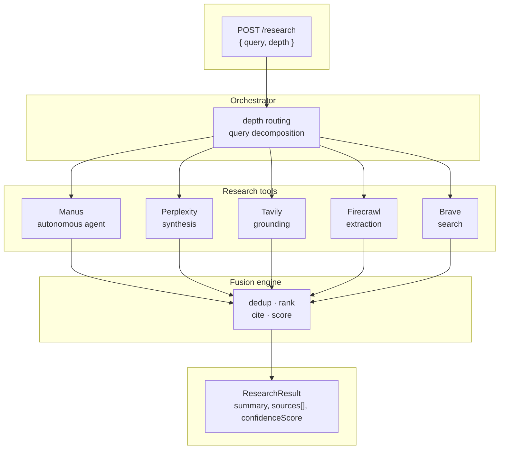

# Deep Research Agent

**One API. Five research engines. Three depth modes.**

A TypeScript monorepo that orchestrates [Manus](https://manus.im), [Perplexity](https://perplexity.ai), [Tavily](https://tavily.com), [Firecrawl](https://firecrawl.dev), and [Brave Search](https://brave.com/search/api/) into a unified deep research pipeline — with deduplicated citations, credibility ranking, and confidence scoring. Use it as an HTTP API or as a library via `@deep-research/sdk`.

```
POST /research { "query": "...", "depth": "quick" }
```

That's it. One endpoint. The orchestrator decides which tools to invoke, runs them in parallel, fuses the results, and returns a ranked research report with traced citations.

---

## How it works

Diagrams are defined in [docs/diagrams/](docs/diagrams/) as Mermaid (`.mmd`) and rendered below.



### Depth modes

| Mode | Tools | Latency | Best for |
|------|-------|---------|----------|
| **`quick`** | Perplexity + Tavily + Brave | ~10–30s | Fast fact-checks, simple questions |
| **`standard`** | Perplexity + Firecrawl + Brave (main) + Tavily (sub-queries) | ~1 min | Thorough research with structured extraction |
| **`deep`** | All five — Manus async + fast tools in parallel | ~10–15 min | Comprehensive multi-source reports |

Each tool plays to its strength:

- **Manus** — autonomous multi-step web research agent, handles complex tasks that require browsing and reasoning
- **Perplexity** — real-time synthesis with inline citations, great for overviews
- **Tavily** — fast AI-optimized search with relevance scoring, ideal for grounding claims
- **Firecrawl** — structured data extraction from web pages, schema-driven output
- **Brave Search** — web search API with broad coverage, good for breadth and fallback

---

## Quickstart

```bash
# Clone and install
pnpm install

# Configure API keys
cp .env.example .env
# Fill in: MANUS_API_KEY, PERPLEXITY_API_KEY, TAVILY_API_KEY, FIRECRAWL_API_KEY, BRAVE_API_KEY

# Build and run
pnpm build
pnpm dev
```

### Make a research request

```bash
# Quick — Perplexity + Tavily, returns in seconds
curl -s http://localhost:3000/research \
  -H "Content-Type: application/json" \
  -d '{"query": "State of agentic AI frameworks 2026", "depth": "quick"}' | jq

# Standard — adds Firecrawl extraction + sub-query decomposition
curl -s http://localhost:3000/research \
  -H "Content-Type: application/json" \
  -d '{"query": "Compare LangGraph vs CrewAI for production use", "depth": "standard"}' | jq

# Deep — all five tools including Manus autonomous agent
curl -s http://localhost:3000/research \
  -H "Content-Type: application/json" \
  -d '{"query": "European AI regulation impact on LLM API market", "depth": "deep"}' | jq
```

### Response shape

```jsonc
{
  "query": "State of agentic AI frameworks 2026",
  "depth": "quick",
  "status": "completed",
  "summary": "...",                    // Best available synthesis
  "sources": [                         // Deduplicated, ranked by credibility
    {
      "url": "https://...",
      "title": "...",
      "snippet": "...",
      "sourceTool": "perplexity",
      "credibilityScore": 0.85
    }
  ],
  "confidenceScore": 0.91,            // Weighted blend of coverage + credibility
  "toolResults": [ ... ]              // Raw per-tool results for inspection
}
```

---

## Architecture

```mermaid
flowchart LR
    subgraph apps["apps"]
        API["api<br/>Hono HTTP server"]
    end
    subgraph packages["packages"]
        SDK["sdk<br/>createResearchOrchestrator"]
        TYPES["types"]
        ORCH["orchestrator"]
        FUSION["fusion"]
        subgraph tools["tools"]
            M["manus"] P["perplexity"] T["tavily"] F["firecrawl"] B["brave"]
        end
    end
    subgraph test["test"]
        E2E["e2e"]
    end
    API --> SDK
    SDK --> ORCH
    SDK --> FUSION
    SDK --> TYPES
    ORCH --> M
    ORCH --> P
    ORCH --> T
    ORCH --> F
    ORCH --> B
    FUSION --> TYPES
    E2E -.->|hits API| API
```

| Path | Role |
|------|------|
| `apps/api/` | Hono HTTP server (entrypoint) |
| `packages/sdk/` | Library: `createResearchOrchestrator`, tool clients, types |
| `packages/types/` | Zod schemas + shared TypeScript types |
| `packages/orchestrator/` | Depth routing, query decomposition, tool dispatch |
| `packages/fusion/` | Dedup, credibility ranking, confidence scoring |
| `packages/tools/*` | manus, perplexity, tavily, firecrawl, brave |
| `test/e2e/` | E2E tests (API must be running; API_KEY if required) |
| `docs/` | [ARCHITECTURE.md](docs/ARCHITECTURE.md), [BLUEPRINT.md](docs/BLUEPRINT.md), [diagrams/](docs/diagrams/) |

### Using as a library

Install the SDK in your agent or app:

```bash
pnpm add @deep-research/sdk
```

Use `createResearchOrchestrator` with your API keys and optional `ManusTaskStore`; run `orchestrator.research(request)` for the same pipeline as the HTTP API. See `packages/sdk/src/index.ts` for exports and [CLAUDE.md](CLAUDE.md) for the factory API.

### Key design decisions

- **Hono over Express** — 10x smaller, zero dependencies, edge-runtime compatible for future deployment on Cloudflare Workers or Vercel Edge
- **`ToolResult` as universal interface** — every tool returns the same shape; adding a 5th tool means implementing one function
- **Fusion separate from orchestration** — synthesis logic is independently testable; the orchestrator only routes, the fusion engine only merges
- **Graceful degradation** — if any tool fails, the pipeline continues with remaining results; `confidenceScore` reflects the gap

### Credibility scoring

The fusion engine applies per-tool credibility weights based on source quality:

| Tool | Weight | Rationale |
|------|--------|-----------|
| Manus | 0.90 | Multi-step autonomous research, highest synthesis depth |
| Perplexity | 0.85 | Real-time web grounding with citations |
| Firecrawl | 0.80 | Direct content extraction, less filtered |
| Tavily | 0.75 | Fast search, good breadth but lower per-result depth |
| Brave | 0.75 | Web search API, broad coverage |

---

## API Reference

### `POST /research`

| Field | Type | Default | Description |
|-------|------|---------|-------------|
| `query` | `string` | *required* | Natural language research query |
| `depth` | `"quick" \| "standard" \| "deep"` | `"standard"` | Research depth mode |
| `outputFormat` | `string` | `"markdown_report"` | Output format (see below) |
| `maxSources` | `number` | `50` | Maximum sources to return (1–500) |
| `language` | `string` | `"en"` | Preferred language |

**Output formats:** `markdown_report`, `structured_json`, `executive_summary`, `rag_chunks`, `citations_list`

### `GET /health`

Returns server status and Manus task store size.

### `POST /webhooks/manus`

Receives async results from Manus. Verifies HMAC signature when `MANUS_WEBHOOK_SECRET` is set.

---

## Environment variables

| Variable | Required | Description |
|----------|----------|-------------|
| `MANUS_API_KEY` | Yes | Manus API key |
| `PERPLEXITY_API_KEY` | Yes | Perplexity API key |
| `TAVILY_API_KEY` | Yes | Tavily API key |
| `FIRECRAWL_API_KEY` | Yes | Firecrawl API key |
| `BRAVE_API_KEY` | Yes | Brave Search API key ([Brave API](https://brave.com/search/api/)) |
| `MANUS_WEBHOOK_SECRET` | Recommended | HMAC secret for webhook verification |
| `WEBHOOK_BASE_URL` | For deep mode | Public URL where Manus delivers results |
| `PORT` | No (default: 3000) | HTTP server port |
| `JOB_STORE_PATH` | No (default: `output/jobs.json`) | Path for persisted job state; directory (e.g. `output/`) is created if missing |
| `API_KEY` | For production | When set, requests must send `x-api-key` header; required if `APP_ENV=production` |

---

## Development

```bash
pnpm install          # Install all workspace packages
pnpm build            # Build all packages
pnpm dev              # Start API in watch mode
pnpm test             # Run Vitest unit tests
pnpm test:e2e         # E2E research test (requires API running: pnpm dev; set API_KEY if server uses it)
pnpm lint             # ESLint check
pnpm typecheck        # TypeScript type check
```

Job state is persisted under `./output` by default (`JOB_STORE_PATH`); `output/` is in `.gitignore`.

### Stack

- **Runtime:** Node.js 22, TypeScript 5
- **API:** [Hono](https://hono.dev)
- **Validation:** [Zod](https://zod.dev)
- **Monorepo:** pnpm workspaces
- **Build:** [tsup](https://tsup.egoist.dev)
- **Test:** [Vitest](https://vitest.dev)

---

## Roadmap

- [ ] Async job pattern for `deep` mode (BullMQ + Redis)
- [ ] LLM-powered query decomposition (replace naive stub)
- [ ] Semantic deduplication via embeddings
- [ ] `outputFormat` and `maxSources` actually applied downstream
- [ ] Retry with exponential backoff on tool clients
- [ ] Langfuse tracing for observability
- [ ] Authentication + rate limiting
- [ ] Exa.ai as additional tool (semantic search)
- [ ] Agentic orchestrator — LLM planner replaces fixed routing
- [ ] Temporal workflows for durable execution

See [ARCHITECTURE.md](docs/ARCHITECTURE.md) §6–9 for detailed analysis of each improvement area and the phased evolution plan.

---

## License

MIT
