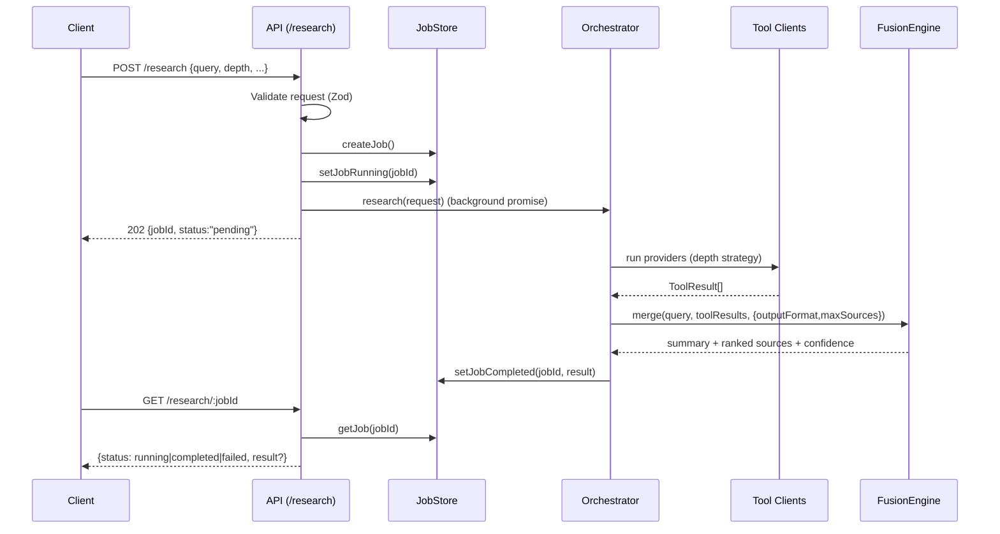

# Deep Research Agent Architecture (As Implemented)

This document describes the architecture currently implemented in code (not target-state design).

## 1) System scope

- Runtime: Node.js + TypeScript monorepo
- HTTP entrypoint: `apps/api` (Hono)
- Library entrypoint: `packages/sdk`
- Research providers: Manus, Perplexity, Tavily, Firecrawl, Brave
- Processing model: asynchronous API jobs + provider orchestration + fusion

## 2) Component architecture

```mermaid
flowchart TD
    C[Client]
    API[Hono API<br/>apps/api]
    JS[(In-memory Job Store<br/>apps/api/job-store.ts)]
    SDK[@deep-research/sdk factory]
    ORCH[ResearchOrchestrator<br/>packages/orchestrator]
    FUS[FusionEngine<br/>packages/fusion]
    MS[(ManusTaskStore<br/>in-memory)]
    W[POST /webhooks/manus]

    P1[PerplexityClient]
    P2[TavilyClient]
    P3[FirecrawlClient]
    P4[BraveClient]
    P5[ManusClient]

    E1[(Perplexity API)]
    E2[(Tavily API)]
    E3[(Firecrawl API)]
    E4[(Brave Search API)]
    E5[(Manus API)]

    C -->|POST /research| API
    API -->|createJob + set running| JS
    API --> SDK --> ORCH
    ORCH --> P1 --> E1
    ORCH --> P2 --> E2
    ORCH --> P3 --> E3
    ORCH --> P4 --> E4
    ORCH --> P5 --> E5
    E5 -->|webhook event| W --> MS
    P5 -->|waitFor task_id| MS
    ORCH --> FUS --> JS
    C -->|GET /research/:jobId| API --> JS
```

## 3) API request lifecycle (async job pattern)

`POST /research` returns `202 { jobId, status: "pending" }`, and the caller polls `GET /research/:jobId`.



## 4) Deep mode execution model

Deep mode starts Manus immediately, then runs the rest. It is partially parallel:

- Manus runs concurrently with other work.
- `main` tools are parallelized together.
- sub-query tools are parallelized together.
- but `main` and `sub` groups run in sequence in current code.

```mermaid
flowchart LR
    Q[Deep request] --> D[Get sub-queries]
    D --> SLOW[Start slow Promise.all(manus)]
    D --> MAIN[Await Promise.all(main: perplexity, firecrawl, brave)]
    MAIN --> SUB[Await Promise.all(subQueries via tavily)]
    SUB --> WAIT[Await slow manuscripts promise]
    SLOW --> WAIT
    WAIT --> MERGE[Fusion merge + rank + confidence]
```

## 5) Manus webhook interaction

```mermaid
sequenceDiagram
    participant O as Orchestrator
    participant M as ManusClient
    participant API as /webhooks/manus
    participant S as ManusTaskStore
    participant EXT as Manus API

    O->>M: run(query)
    M->>EXT: POST /v1/tasks
    EXT-->>M: {task_id}
    M->>S: init(task_id)
    M->>S: waitFor(task_id)
    EXT->>API: webhook event task_stopped
    API->>API: verify signature (RSA-SHA256; dev fallback)
    API->>S: set(task_id, completed|failed)
    S-->>M: resolve waiter
    M-->>O: ToolResult(manus)
```

## 6) Library embedding architecture

The same engine can be embedded directly without HTTP:

```mermaid
flowchart TD
    APP[Your Node app]
    FAC[createResearchOrchestrator(keys, options)]
    O2[ResearchOrchestrator]
    R[ResearchResult]

    APP --> FAC --> O2
    APP -->|orchestrator.research(request)| O2 --> R
```

Notes:
- `@deep-research/sdk` exports factories, clients, schemas, and types.
- In library mode, calls are synchronous from the caller's perspective (no built-in external job queue/persistence).

## 7) Current contracts and behaviors

### Request schema (`ResearchQuery`)
- `query: string`
- `depth: quick | standard | deep`
- `outputFormat: markdown_report | structured_json | executive_summary | rag_chunks | citations_list`
- `maxSources: number (1..500)`
- `language: string`

### Observed behavior
- `outputFormat` and `maxSources` are passed into fusion and applied.
- Summary generation does not use an LLM; it is template/priority based.
- Tool failures return `success: false` `ToolResult` and overall output still completes when possible.

## 8) Observability currently in place

- Structured logs with `pino` (`apps/api/src/logger.ts`).
- Request logging middleware in API.
- `onToolEvent` callback hook from orchestrator for per-tool invoke/response events.

No OpenTelemetry traces/metrics exporter is implemented yet.

## 9) Operational constraints

- Job store and Manus task store are both in-memory only (single-process scope).
- Process restart loses in-flight and historical jobs.
- No built-in output-folder persistence for results.
- Current async pattern is API-only; SDK consumers must implement their own persistence/queue if needed.
