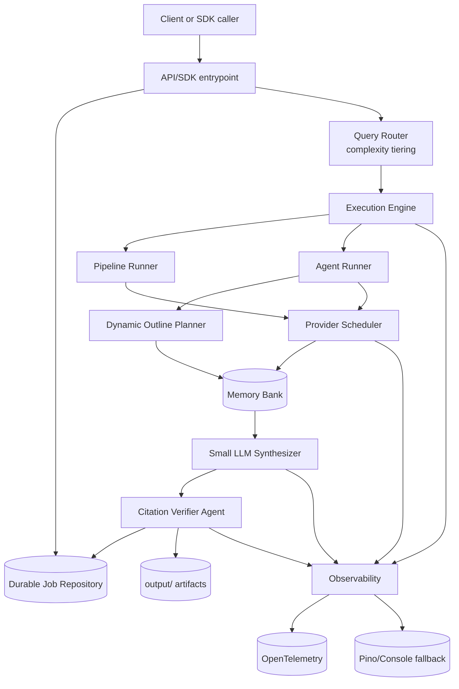

# Best Architecture for Agentic Deep Research (Spec-Aligned)

This document translates `agentic-deep-research-spec` into a concrete architecture for this repository.

## 1) Architecture choice

From the spec taxonomy (single-agent, multi-agent, planner-writer hybrid), the best fit is a **hybrid adaptive architecture**:

1. **Tiered query router** chooses complexity tier up front.
2. **Execution mode selection** chooses pipeline vs agent loop based on tier and request mode.
3. **Dynamic outline + memory bank** is enabled for open-ended report tasks.
4. **Budget-aware orchestration** controls cost and prevents over-search.
5. **Dedicated citation verification pass** improves factual traceability.

This keeps simple requests fast while enabling high-quality deep research when needed.

## 2) Target system architecture

## 3) Execution strategy by complexity tier

| Tier | Default strategy | Providers | Context strategy | Budget profile |
|---|---|---|---|---|
| Simple | Pipeline (single pass) | 2-3 providers | no heavy memory | low |
| Medium | Pipeline + adaptive sub-queries | 3-5 providers | lightweight summary checkpoints | medium |
| Complex | Agent mode with sub-agents | all configured providers | memory bank + periodic summarization | high |
| Open-ended report | Planner-writer hybrid | all + optional specialist tools | dynamic outline + hierarchical retrieval | very high |

## 4) Core implementation patterns from the spec

## A) Query Router (mandatory)
- Classify intent and complexity before execution.
- Prevent over-allocation of agents/tool calls for simple questions.
- Set initial limits: `maxToolCalls`, `maxAgents`, `maxIterations`, token budget.

## B) Budget-aware execution (mandatory)
- Inject live budget signal into planner/sub-agent prompts.
- Decision policy: continue, dig deeper, pivot, or synthesize now.
- Hard stop when budget floor is reached.

## C) Memory Bank + Dynamic Outline (for open-ended)
- Keep evidence entries with URL/title/snippet/relevance.
- Track outline section status (`empty/partial/complete`) and linked evidence IDs.
- Writer retrieves only evidence linked to current section.

## D) Dedicated Citation Verifier (mandatory for trust)
- Post-synthesis pass verifies claim-source support.
- Mark unsupported/contradicted claims explicitly.
- Produce citation quality metrics.

## E) Durable async execution (mandatory)
- Persist jobs at launch, checkpoint long-running state, support resume.
- API always returns async job references.
- SDK supports same lifecycle abstraction.

## F) Observability (mandatory)
- OTel spans for routing, provider calls, synthesis, citation verification, persistence.
- Emit metrics for latency, provider failures, token/cost, citation coverage.
- Never fail requests due to telemetry export issues; fallback to pino logs.

## 5) Package-level implementation map for this repo

## Existing packages to extend
- `packages/types`
  - add mode/tier/providers/budget/synthesizer/output persistence fields
  - add `ResearchState`, `MemoryEntry`, `OutlineSection`, `BudgetState`
- `packages/orchestrator`
  - split into router + scheduler + execution strategy selection
  - add direct-mode provider fanout and bounded concurrency
- `packages/fusion`
  - keep ranking; add synthesizer handoff contract and citation verification inputs
- `apps/api`
  - durable job backend adapter
  - artifact writer under `output/`
  - async lifecycle parity with SDK

## New packages recommended
- `packages/agent` (planner loop + sub-agent execution)
- `packages/memory` (memory bank and outline store)
- `packages/citations` (claim-to-source verification pass)
- `packages/observability` (OTel + fallback integration)

## 6) "Best architecture" delivery order

1. **Router + contract upgrade**
2. **Direct-mode parallel scheduler**
3. **Budget-aware execution signals**
4. **Synthesis + citation verifier**
5. **Agent runner + dynamic outline for open-ended tasks**
6. **Durable persistence + output artifacts**
7. **OTel instrumentation + dashboards**

## 7) Definition of done for architecture compliance

- Query complexity routing is active and measurable.
- Pipeline and agent modes both run with shared provider adapters.
- Direct provider mode runs selected providers in parallel.
- Final output includes synthesized answer plus verified citations.
- Jobs are durable and artifacted under `output/`.
- OTel telemetry is emitted; fallback logging remains available.
