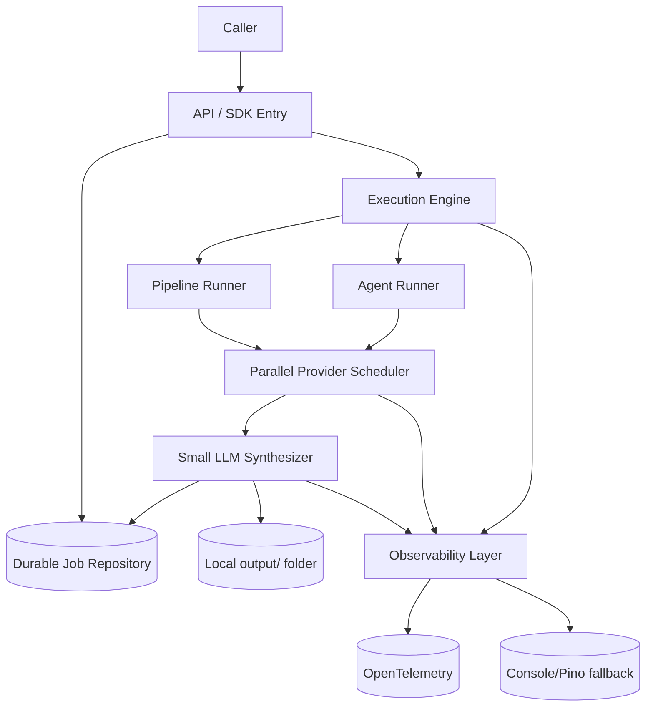
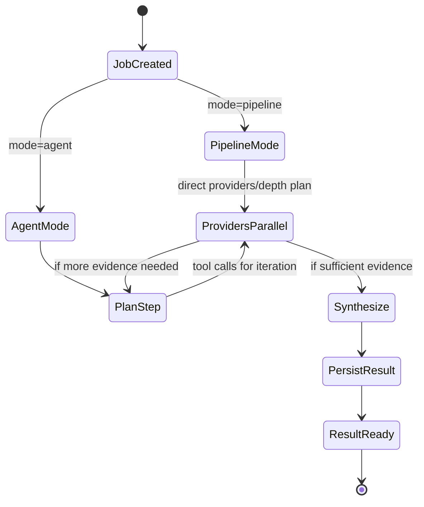

# GAP Analysis: Library / Tool / Subagent + Pipeline / Agent Modes

This analysis compares the **current implementation** against the requested target:

1. Usable as a **library**, a **tool**, or a **subagent**
2. Invocable in **pipeline mode** or **agent mode**
3. **Direct mode** where API input specifies provider sequence; providers run in parallel; a small LLM condenses outputs into one ranking + answer
4. All jobs launched asynchronously and stored; results returned and stored locally in an output folder
5. Observability to **OpenTelemetry** with fallback to console output

---

## 1) Current-state summary

### What already exists
- Library entrypoint via `@deep-research/sdk` (`packages/sdk/src/index.ts`)
- Async HTTP job pattern:
  - `POST /research` -> `202 { jobId }`
  - `GET /research/:jobId` to poll status/result
  - implemented in `apps/api/src/index.ts` + `apps/api/src/job-store.ts`
- Provider orchestration with depth strategies in `packages/orchestrator/src/index.ts`
- Fusion/ranking layer in `packages/fusion/src/index.ts`
- Structured logs (`pino`) + tool invoke/response hooks (`onToolEvent`)

### Key limits
- No explicit agent-mode planner/loop
- No API parameter for provider sequence
- No LLM condensation in fusion
- In-memory job/task stores only (non-durable)
- No output-folder persistence
- No OpenTelemetry exporter

---

## 2) Requirement-by-requirement gap matrix

| ID | Requirement | Current status | Evidence | Gap |
|---|---|---|---|---|
| R1 | Usable as **library** | **Met** | `packages/sdk/src/index.ts` exports orchestrator/tools/types | None for baseline use |
| R2 | Usable as **tool** | **Partial** | HTTP API exists (`apps/api/src/index.ts`) and tool clients exist (`packages/tools/*`) | No standardized "tool adapter" contract for external agent frameworks |
| R3 | Usable as **subagent** | **Missing** | No package exposing subagent runtime contract | Need explicit subagent wrapper and I/O contract |
| R4 | **Pipeline mode** | **Met (fixed strategy)** | Depth-based orchestrator (`quick/standard/deep`) | Pipeline is fixed by depth; caller cannot customize provider order/selection |
| R5 | **Agent mode** (agent uses providers as tools) | **Missing** | No planner/loop state machine | Need agent planner + iterative tool-use controller |
| R6 | **Direct mode**: request specifies provider sequence | **Missing** | `ResearchQuerySchema` lacks provider sequence fields | Need schema + runtime execution planner for caller-defined provider sets |
| R7 | Providers execute in parallel | **Partial** | `runQuick` fully parallel; `runStandard` and `runDeep` are group-sequential | Need full parallel scheduler for direct mode (and optional bounded concurrency) |
| R8 | Small LLM condenses results into one ranked answer | **Missing** | Fusion `buildSummary()` is rule-based, no LLM call | Need synthesizer component (small model) with citation-preserving output |
| R9 | Jobs stored at launch and everything async | **Partial** | API job store exists and job created before orchestration | SDK/library path is synchronous; stores are in-memory only (non-durable) |
| R10 | Results returned and stored in local output folder | **Missing** | No filesystem persistence in API/sdk | Need output writer (`/output/{jobId}.json|md`) |
| R11 | OpenTelemetry + console fallback | **Partial** | Console/structured logs via pino exist | No OTel traces/metrics/log export pipeline |

---

## 3) Architecture delta (target vs current)

---

## 4) Detailed implementation gaps by subsystem

## A. Contracts (`packages/types`)

### Missing fields for requested modes
Current `ResearchQuerySchema` has only `query/depth/outputFormat/maxSources/language`.

Add fields such as:
- `mode: "pipeline" | "agent"` (default `"pipeline"`)
- `providers?: string[]` (direct mode sequence/priority)
- `execution?: { parallel: boolean; maxConcurrency?: number }`
- `synthesizer?: { enabled: boolean; model?: string }`
- `persistOutput?: boolean`
- `outputPath?: string` (default `"output"`)

## B. Orchestration (`packages/orchestrator`)

### Current
- Fixed depth-driven routing.
- Partial parallelism in standard/deep (main and sub groups are sequential).

### Needed
- `runDirect()` for caller-specified provider list.
- Unified scheduler that can launch requested providers concurrently and collect normalized `ToolResult[]`.
- Optional bounded concurrency to avoid API budget spikes.

## C. Agent mode (new package recommended, e.g. `packages/agent`)

### Missing today
- No planner loop, tool selection loop, stop criteria, or tool-call memory.

### Needed
- `AgentResearchRunner` that:
  1. plans which tool(s) to call next,
  2. executes tool calls,
  3. evaluates sufficiency/conflicts,
  4. repeats until stop condition, then hands to synthesizer.

## D. Synthesis (`packages/fusion` or new `packages/synthesizer`)

### Current
- Priority-based summary selection.
- No LLM condensation.

### Needed
- Small-model summarizer to combine multi-provider outputs into:
  - ranked source list,
  - consolidated answer,
  - confidence rationale.
- Must preserve traceability from final claims to citations.

## E. Job persistence (`apps/api/src/job-store.ts`)

### Current
- In-memory `Map`, TTL eviction.
- Lost on restart; not multi-instance safe.

### Needed
- Durable repository (Redis/Postgres/file-backed) for:
  - job metadata,
  - tool intermediate states,
  - final result pointers.
- Keep async launch semantics for API and expose same abstraction for SDK.

## F. Local output persistence

### Current
- No output artifacts written to disk.

### Needed
- Output writer service:
  - `output/{jobId}.json` (full result),
  - optional `output/{jobId}.md` (human report),
  - optional per-tool raw captures `output/{jobId}/{tool}.json`.

## G. Observability

### Current
- Pino logs + orchestrator tool event hook.

### Needed
- OpenTelemetry spans:
  - request span,
  - per-tool spans (latency, success/failure),
  - synthesis span.
- Exporters configurable by env.
- Fallback path: existing pino/console when OTel exporter unavailable.

---

## 5) Target operating modes (proposed behavior)

---

## 6) Suggested implementation sequence (technical order)

1. **Schema and API contract upgrade**
   - Add mode/providers/execution/synthesizer/output persistence fields.
2. **Execution engine split**
   - Keep existing depth pipeline.
   - Add direct provider execution path.
3. **Durable job repository abstraction**
   - Replace in-memory job store with pluggable backend.
4. **Output writer**
   - Persist result artifacts under `output/`.
5. **Small LLM synthesizer**
   - Add post-aggregation condensation with citation mapping.
6. **Agent runner**
   - Introduce iterative planner/tool loop.
7. **OpenTelemetry integration**
   - Instrument request/tool/synthesis spans with pino fallback.

---

## 7) Acceptance checklist for requested target

- [ ] Same codebase can be invoked as library, API tool, and subagent component.
- [ ] Request supports `mode=pipeline|agent`.
- [ ] Direct mode accepts provider sequence in request payload.
- [ ] Provider calls run in parallel under scheduler constraints.
- [ ] Small LLM synthesizes one consolidated ranked answer.
- [ ] Every launch creates a persisted async job record.
- [ ] Result returned via polling/callback and written under local `output/`.
- [ ] OpenTelemetry emits traces/metrics; console/pino fallback remains available.
